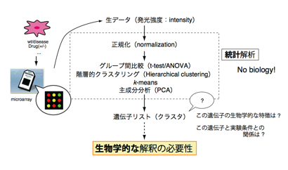
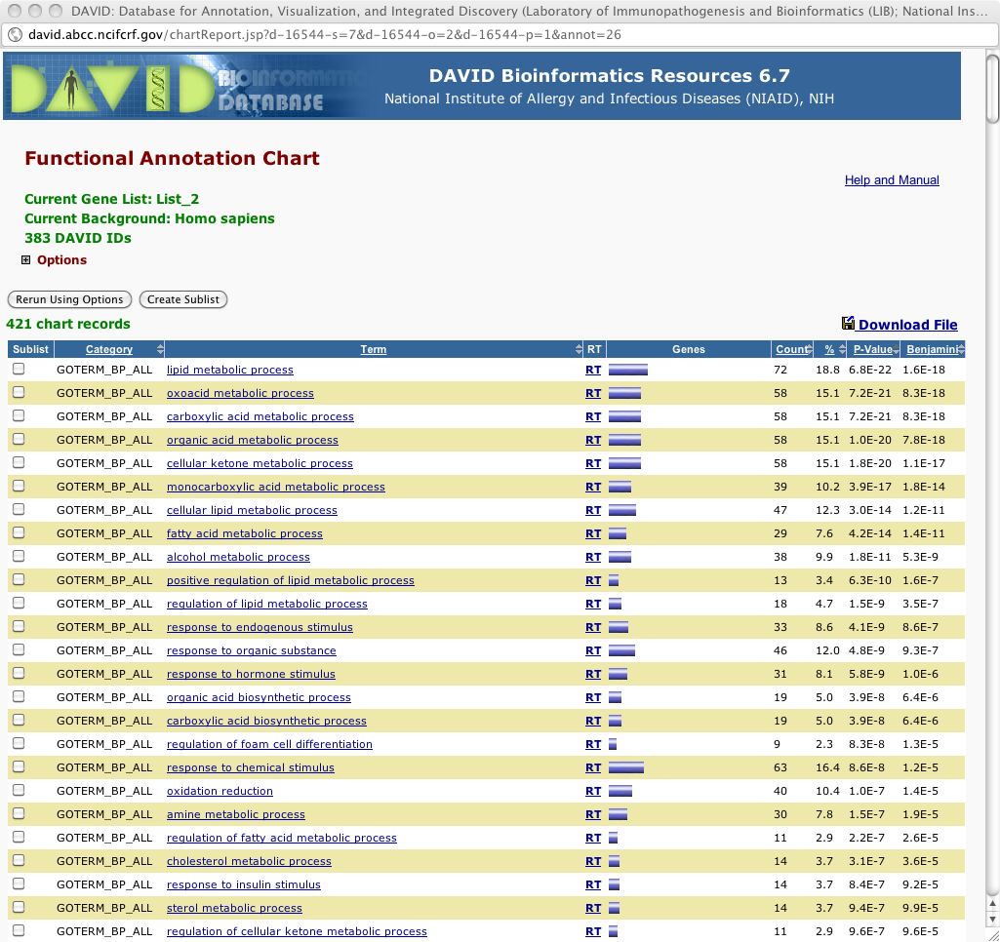
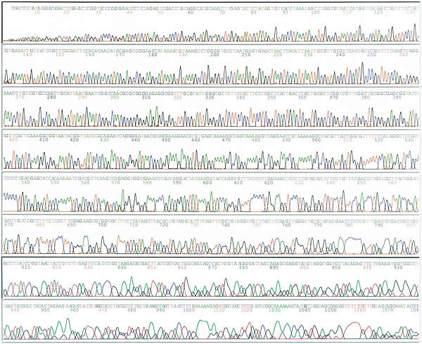
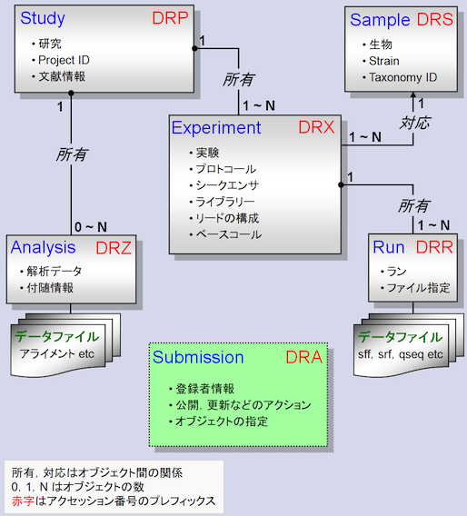
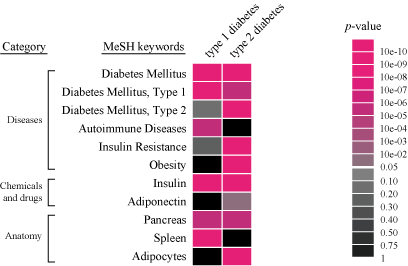

ゲノム創薬学特論A 特別講義
# 創薬研究のためのデータベース活用術：文献からの知識抽出とその応用
12/10/15 10:50-12:10
## 担当：<a href="http://dbcls.rois.ac.jp/~nakazato/" rel="nofollow">仲里 猛留</a>（<a href="http://dbcls.rois.ac.jp/" rel="nofollow">ライフサイエンス統合データベースセンター</a>）

目次

<ul class="list1" style="padding-left:16px;margin-left:16px"><li><a href="#c5a40334"> 自己紹介 </a></li>
<li><a href="#o94e7e85"> DBCLSの紹介 </a></li>
<li><a href="#teda2209"> 遺伝子発現解析 </a>
<ul class="list2" style="padding-left:16px;margin-left:16px"><li><a href="#td861550"> NCBI Gene Expression Omnibus (GEO) </a>
<ul class="list3" style="padding-left:16px;margin-left:16px"><li><a href="#kce7b8a1"> 遺伝子発現バンク(GEO)目次：http://lifesciencedb.jp/geo/ </a></li>
<li><a href="#y259e8fe"> 【実習】データセットブラウザ(Dataset browser)を利用して、GEOに登録されているマイクロアレイデータを解析する </a></li>
<li><a href="#h3822e5b"> [参考] ArrayExpress </a></li></ul></li>
<li><a href="#c7d295ac"> DAVID: The Database for Annotation, Visualization and Integrated Discovery </a>
<ul class="list3" style="padding-left:16px;margin-left:16px"><li><a href="#v61084ff"> 【実習】DAVIDを用いて、発現データの結果を生物学的に解釈する </a></li></ul></li>
<li><a href="#x0c4b5f7"> 次世代シーケンサ（とそのデータ）基礎知識</a>
<ul class="list3" style="padding-left:16px;margin-left:16px"><li><a href="#u53454b9"> 何が新型／次世代なのか? </a></li></ul></li>
<li><a href="#j6cd4673"> SRAとは </a>
<ul class="list3" style="padding-left:16px;margin-left:16px"><li><a href="#sf7df990"> [参考] NCBI SRAやめます事件(11/2/16 現地時間) </a></li>
<li><a href="#ge26a128"> 【実習】DRASearchを使ってみる（ http://trace.ddbj.nig.ac.jp/DRASearch/ ） </a></li>
<li><a href="#ua06a95a"> 統計情報から検索する (SRAs： http://sra.dbcls.jp/ ) </a></li>
<li><a href="#k43437ef"> 文献から検索する </a></li>
<li><a href="#neab7413"> 疾患から検索する </a></li>
<li><a href="#oeb6c9d7"> SRAへのNGSデータの登録 </a></li></ul></li></ul></li>
<li><a href="#r890402c"> 文献情報の活用 </a>
<ul class="list2" style="padding-left:16px;margin-left:16px"><li><a href="#v3337a63"> PubMed トリビア </a></li>
<li><a href="#o4ce1db8"> 日本語リソース </a></li>
<li><a href="#xdc902d5"> 文献情報の利用 </a>
<ul class="list3" style="padding-left:16px;margin-left:16px"><li><a href="#wfe92190"> 自然言語処理とは </a></li>
<li><a href="#tbbb087a"> 自然言語リソースを活用しよう! </a></li>
<li><a href="#vfeae525"> 文献データを利用した発現解析 </a></li></ul></li></ul></li></ul>

<h3 id="content_1_0"> 自己紹介  </h3>

<h3 id="content_1_1"> DBCLSの紹介  </h3>

<h3 id="content_1_2"> 遺伝子発現解析  </h3>

<h3 id="content_1_3"> <a href="http://www.ncbi.nlm.nih.gov/geo/" rel="nofollow">NCBI Gene Expression Omnibus (GEO)</a>  </h3>

世界最大の遺伝子発現（<a href="http://ja.wikipedia.org/wiki/DNA%E3%83%9E%E3%82%A4%E3%82%AF%E3%83%AD%E3%82%A2%E3%83%AC%E3%82%A4" rel="nofollow">マイクロアレイ</a>）データベース（レポジトリ）

塩基配列を研究者がGenBank (Nucleotide) に登録し、世界の人が見られるのと同じように、各々の発現情報も集められてみられるようになっています。それがGEOです。

<ul class="list1" style="padding-left:16px;margin-left:16px"><li>いろいろなデータ（DataSet, Sample, Platform）が出てきて混乱するかと思います。<a href="http://www.ncbi.nlm.nih.gov/geo/info/overview.html" rel="nofollow">NCBI GEO Overview</a>が参考になるでしょう。</li></ul>

<h4 id="content_1_4"> 遺伝子発現バンク(GEO)目次：<a href="http://lifesciencedb.jp/geo/" rel="nofollow">http://lifesciencedb.jp/geo/</a>  </h4>
<ul class="list1" style="padding-left:16px;margin-left:16px"><li><a href="http://lifesciencedb.jp/" rel="nofollow">統合ホームページ</a> &gt; データベース &gt; 遺伝子発現バンク(GEO)目次</li>
<li>[ナニコレ] NCBIのGEO（Gene Expression Omnibus:mRNA発現情報のデータベース）に登録されている全レコードをプロジェクト単位で分類。「生物種」、「研究の型」、「部位」の三次元で分類。データを一括ダウンロード可能</li>
<li> <a href="http://togotv.dbcls.jp/20080623.html" rel="nofollow">遺伝子発現バンク(GEO)目次を使い倒す－その壱</a></li>
<li>【実習】「生物種」で特定の種を選ぶと、研究プロジェクト数が絞り込まれることで数が変化する。「生物種」で「ヒト」を選ぶ前と後で「研究の型」の「GeneChip」(Affymetrixの発現アレイ)、「cDNAアレイ」、「オリゴアレイ」の項目はいくつからいくつに変化するか？また、「生物種」に「齧歯」を選ぶとそれぞれどうか？</li>
<li>【実習】右上の検索フォームで'hypoxia'と入力して検索したあとで、「生物種」で「ヒト」、「研究の型」で「GeneChip」を選んで得られる研究プロジェクトのリストを表示せよ。「測定サンプル」のカラムの数字をクリックしてどのようなことが起こるか、確認してみよ。また、GSEで始まるGEOのエントリ（例えばGSE4725）をクリックするとNCBIのサイトに直接アクセスできるので、そのページにアクセスせよ。</li></ul>

<h4 id="content_1_5"> 【実習】データセットブラウザ(Dataset browser)を利用して、GEOに登録されているマイクロアレイデータを解析する  </h4>
<ul class="list1" style="padding-left:16px;margin-left:16px"><li><a href="http://togotv.dbcls.jp/20120128.html#p01" rel="nofollow">【使い方参考動画1】</a> 、<a href="http://togotv.dbcls.jp/20120227.html#p01" rel="nofollow">【使い方参考動画2】</a></li>
<li>1. <a href="http://www.ncbi.nlm.nih.gov/geo/" rel="nofollow">http://www.ncbi.nlm.nih.gov/geo/</a>を開きます。</li>
<li>2.「Gene profiles」に自分の検索したい遺伝子名を入力します。</li>
<li>3. 今回は例として「<a href="http://www.google.co.jp/search?hl=ja&amp;q=Nanog%E9%81%BA%E4%BC%9D%E5%AD%90" rel="nofollow">nanog</a>」という遺伝子を検索してみましょう。入力終了後、「GO」をクリックします。</li>
<li>4. GEOに登録されている様々な実験条件で行なわれたマイクロアレイ実験における「nanog」遺伝子の発現データが表示されます。</li>
<li>5. 検索結果の<a href="http://www.ncbi.nlm.nih.gov/sites/GDSbrowser?acc=GDS2294" rel="nofollow">アクセッション番号（今回は GDS2294）</a>をクリックすると、解析用の「データセットブラウザ」が開きます。</li>
<li>6. 「Expression profiles」をクリックすると、この実験データセットにおける個々の遺伝子発現状況を検索できるページに飛びます。</li>
<li>7. 検索窓に表示されているアクセッション番号の後に続けて遺伝子名を追加（今回は例として <a href="http://www.google.co.jp/search?q=Oct4" rel="nofollow">Oct4</a> ）すると、この実験データセット内におけるその遺伝子の発現データが検索できます。</li>
<li>8. 「データセットブラウザ」の「Data Analysis Tools」では詳細なデータ解析が可能です。</li>
<li>9.  Quality Check: 「Experiment design and value distribution」では実験データにおける発現の分布を参照できます。これにより、各サンプルのデータが互いに比較可能か（実験上のミスがないか）チェックすることができます。</li>
<li>10. 特定実験での各遺伝子の振る舞い: 「Find gene name or symbol:」のところに自分の興味ある遺伝子名を入れてみましょう。</li>
<li>11. 「Find genes that are up/down for this condition(s):」の「GO」をクリックするとどのような遺伝子がヒットするでしょうか。</li>
<li>12. クラスタリング等の解析: 「Compare 2 sets of samples」では2群間で発現に差のある遺伝子を（統計学的に）検索できます。step1で発現量の違いを検出する方法を設定します。step.2で比較する2群の設定をします。step.3の「Query Group A vs. B」をクリックすると、検索が始まります。</li>
<li>13. 「Cluster heatmaps」では、マイクロアレイデータ解析でよく用いられるヒートマップでのデータ表示が行なえます。分類方法としてHierarchical、Partitional (K-means/K-medians)、By location on chromosomeの3種類が選べますが、それぞれどのようにデータが分類されるか試してみましょう。</li></ul>

<h4 id="content_1_6"> [参考] <a href="http://www.ebi.ac.uk/arrayexpress/" rel="nofollow">ArrayExpress</a>  </h4>
<ul class="list1" style="padding-left:16px;margin-left:16px"><li>[ナニコレ] GEOと双璧をなす遺伝子発現情報のデータベース</li>
<li>European Bioinformatics Institute (EBI)が提供・維持管理している遺伝子発現情報のデータベースで、主にマイクロアレイのデータを収載</li>
<li>統合TV：<a href="http://togotv.dbcls.jp/20120217.html#p01" rel="nofollow">ArrayExpressを使い倒す1　データの検索方法および生データのダウンロード方法 2012</a></li>
<li>統合TV：<a href="http://togotv.dbcls.jp/20120218.html#p01" rel="nofollow">ArrayExpressを使い倒す2　Atlas of Gene Expressionを使って遺伝子発現状況を調べる 2012</a></li></ul>

<h3 id="content_1_7"> <a href="http://david.abcc.ncifcrf.gov/" rel="nofollow">DAVID: The Database for Annotation, Visualization and Integrated Discovery</a>  </h3>

マイクロアレイデータの生物学的な解釈

<ul class="list1" style="padding-left:16px;margin-left:16px"><li>上で述べたマイクロアレイの結果の解析は、統計解析で、それらの遺伝子が生物学的にどういう意味を持つかわかりません。</li>
<li>そこで、Gene Ontologyの用語を付与することで、生物学的な解釈を行います。</li>
<li>【参考動画】<a href="http://togotv.dbcls.jp/20120927.html#p01" rel="nofollow">DAVIDを使ってマイクロアレイデータを解析する</a></li></ul>

<h4 id="content_1_8"> 【実習】DAVIDを用いて、発現データの結果を生物学的に解釈する  </h4>
<ul class="list1" style="padding-left:16px;margin-left:16px"><li>1. 上部メニューの「Start Analysis」をクリック</li>
<li>2. 画面左側バーで、probe IDリストをコピペ or ファイルを指定
<ul class="list2" style="padding-left:16px;margin-left:16px"><li>今回は、統合TVと同じ、NCBI GEOより取得した公共の遺伝子発現データ（GSE1657:Adipocyte Differentiation [Homo sapiens]）を用いて、ヒトの脂肪細胞の分化過程で発現増加した<a href="http://motdb.dbcls.jp/?plugin=attach&amp;refer=AJACS12%2Fhono3&amp;openfile=090907_sample_U133A_adipo.txt" rel="nofollow">上位500個の遺伝子群のリスト</a>を使って説明しています。</li></ul></li>
<li>3. リストのIDの種類タイプを選択 … 今回は、「AFFYMETRIX_3PRIME_IVT_ID」と「Gene List」</li>
<li>4. Submit List をクリック → 読み込まれる</li>
<li>5. 今、アップロードしたリストは、左側バーの「List Manager」で「Uploaded List_1」として保存されています。削除やrenameもできます。</li>
<li>6. （画面がかわりました。この項目は削除）</li>
<li>7. 今回は、Gene Ontologyでの解析を行います。「Gene Ontology」をクリック → Gene Ontologyでの解析の細かいメニューが表示されます</li>
<li>8. 今回は、GOTERM_BP_ALL (BP=Biological Process)に注目します。その右の「Chart」をクリック → 結果がポップアップします</li>
<li>9. P-value を2回クリックしてp-valueが小さい（統計的に有意である）順にしてみましょう … p-value小さい順は、一度やればしばらく覚えているので、次からはしばらくは必要ないです

結果

</li>
<li>[応用編] Pathways &gt; KEGG_PATHWAY や Tissue Expression &gt; UP_TISSUE なども見てみよう。生物学的にどういうことが言えるだろうか。</li></ul>

<h3 id="content_1_9"> 次世代シーケンサ（とそのデータ）基礎知識 </h3>
<ul class="list1" style="padding-left:16px;margin-left:16px"><li>今回は省略しますが、書いておくだけはしておきます。</li></ul>

<h4 id="content_1_10"> 何が新型／次世代なのか?  </h4>
<ul class="list1" style="padding-left:16px;margin-left:16px"><li>90年代
<ul class="list2" style="padding-left:16px;margin-left:16px"><li>ゲル板</li>
<li>ポリアクリルアミドゲル電気泳動 + 蛍光標識ダイデオキシヌクレオチド

<a href="http://bunseiserver.pharm.hokudai.ac.jp/gihou/sequence.html" rel="nofollow">DNAシーケンス解析（北大・薬・分子生物）より</a></li>
<li><a href="http://ja.wikipedia.org/wiki/DNA%E3%82%B7%E3%83%BC%E3%82%AF%E3%82%A8%E3%83%B3%E3%82%B7%E3%83%B3%E3%82%B0#.E6.A4.9C.E5.87.BA" rel="nofollow">DNAシークエンシング - Wikipedia -- 検出</a>も参照</li></ul></li></ul>
<ul class="list1" style="padding-left:16px;margin-left:16px"><li>00年代
<ul class="list2" style="padding-left:16px;margin-left:16px"><li>キャピラリ

<a href="http://www.appliedbiosystems.jp/website/jp/product/modelpage.jsp?MODELCD=50768&amp;MODELPGCD=66447" rel="nofollow">ABI PRISM&#174; 3100-Avant Genetic Analyzerより</a></li></ul></li></ul>
<ul class="list1" style="padding-left:16px;margin-left:16px"><li>10年代
<ul class="list2" style="padding-left:16px;margin-left:16px"><li>NGSの登場</li>
<li>Sanger法（dideoxy法）→ パイロシーケンシング</li>
<li>（参考）<a href="http://www.youtube.com/watch?v=l99aKKHcxC4" rel="nofollow">原理の動画 (Illumina)</a>

<a href="http://www.hssnet.co.jp/2/2_3_10_1.html" rel="nofollow">次世代シーケンス解析サービス：概要・原理 | 北海道システム・サイエンス株式会社</a>より</li>
<li>超並列</li>
<li>どんなの?
<ul class="list3" style="padding-left:16px;margin-left:16px"><li>Illumina Genome AnalyzerIIx

</li>
<li>Roche GS FLX+

</li>
<li>SOLiD3+

</li>
<li>Togo picture gallery ( <a href="http://g86.dbcls.jp/~togoriv/" rel="nofollow">http://g86.dbcls.jp/~togoriv/</a> ) より

&#169; 2011 DBCLS Licensed under CC 表示 2.1 日本
←クレジットをいれれば、転載・改変・再利用 OK</li></ul></li></ul></li></ul>

<h3 id="content_1_11"> SRAとは  </h3>
<ul class="list1" style="padding-left:16px;margin-left:16px"><li>NGSのデータのレポジトリサイトです</li>
<li>SRA = Sequence Read Archive
<ul class="list2" style="padding-left:16px;margin-left:16px"><li>昔は「Short Read Archive」だったが、shortでなくなってきたので</li></ul></li>
<li>誰（どこ）が集めているのか?
<ul class="list2" style="padding-left:16px;margin-left:16px"><li>NCBI（米）: <a href="http://trace.ncbi.nlm.nih.gov/Traces/sra/sra.cgi?" rel="nofollow">SRA</a></li>
<li>EBI（欧）: <a href="http://www.ebi.ac.uk/ena/home" rel="nofollow">ENA</a> (European Nucleotide Archive)</li>
<li>DDBJ（日）: <a href="http://trace.ddbj.nig.ac.jp/dra/index.shtml" rel="nofollow">DRA</a> (DDBJ Sequnece Read Archive)</li>
<li>3局でデータの交換をしている
<ul class="list3" style="padding-left:16px;margin-left:16px"><li>DDBJを見に行ったとして、入っているのは日本だけ、ということはない、ということです。</li>
<li>（ただ、個人情報にからむものは、実際の配列データはしかるべきところにしかないものがあるとかないとか）</li></ul></li></ul></li></ul>

<h4 id="content_1_12"> [参考] NCBI SRAやめます事件(11/2/16 現地時間)  </h4>
<ul class="list1" style="padding-left:16px;margin-left:16px"><li><a href="http://www.ncbi.nlm.nih.gov/About/news/16feb2011" rel="nofollow">NCBI To Discontinue Sequence Read Archive and Peptidome</a>
<ul class="list2" style="padding-left:16px;margin-left:16px"><li>予算がなくなったのでやめます</li>
<li>解析結果は受け付けます
<ul class="list3" style="padding-left:16px;margin-left:16px"><li>RNA-Seq, ChIP-Seq, and epigenomic data that are submitted to GEO</li>
<li>Genomic and Transcriptomic assemblies that are submitted to GenBank</li>
<li>16S ribosomal RNA data associated with metagenomics that are submitted to GenBank</li></ul></li>
<li>EBI、DDBJは直後に続けます宣言
<ul class="list3" style="padding-left:16px;margin-left:16px"><li><a href="http://www.ebi.ac.uk/ena/SRA_announcement_Feb_2011.pdf" rel="nofollow">EMBL-EBI will continue to support the Sequence Read Archive for raw data (PDF)</a></li>
<li><a href="http://www.ddbj.nig.ac.jp/whatsnew/2011/DRA20110222.html" rel="nofollow">DDBJ will continue Sequence Raw Data Archiving</a></li></ul></li></ul></li>
<li>NCBI SRA（一応）続けられます宣言(11/5/9)
<ul class="list2" style="padding-left:16px;margin-left:16px"><li>（とりあえず）<a href="http://trace.ncbi.nlm.nih.gov/Traces/sra/sra.cgi?view=history" rel="nofollow">SRA Archive is still in service. (List of all News, Events and Notifications)</a></li></ul></li></ul>

<h4 id="content_1_13"> 【実習】DRASearchを使ってみる（ <a href="http://trace.ddbj.nig.ac.jp/DRASearch/" rel="nofollow">http://trace.ddbj.nig.ac.jp/DRASearch/</a> ）  </h4>
<ul class="list1" style="padding-left:16px;margin-left:16px"><li>こういうときはNCBIと思いがちですが、データ転送量が多い + インターフェースきれい なのでDDBJを使いましょう
<ul class="list2" style="padding-left:16px;margin-left:16px"><li><a href="http://trace.ddbj.nig.ac.jp/DRASearch/" rel="nofollow">http://trace.ddbj.nig.ac.jp/DRASearch/</a> にアクセス</li>
<li>Keyword に興味のある語を入れてみましょう（例：variation）</li>
<li>Filtered by の document type で絞り込み：Study</li>
<li>Filtered by の organism で絞り込み：Homo sapiens</li>
<li>ACCESSION の SRP...... をクリック → 詳細が</li>
<li>画面右の Navigation にあるFASTQやSRALiteからデータがダウンロード可能</li></ul></li>
<li>DDBJにあるドキュメント見てみる
<ul class="list2" style="padding-left:16px;margin-left:16px"><li>データ構造（StudyとかExpとかRunとか）

<a href="http://trace.ddbj.nig.ac.jp/dra/documentation.shtml" rel="nofollow">DDBJ Sequence Read Archive - Document - Metadata</a>より</li>
<li>実データ
<pre>@DRR001107.1 GEZQ5FO01EEA7F length=77
GCAACATTCAACACATATGTGTTGAATGTTGCACGACGGNGTGTCGCGTCTCTCAAGGCACACAGGGAGTAGNGNNN
+DRR001107.1 GEZQ5FO01EEA7F length=77
C@BBBECCECDBBBAAAAA&lt;441111&lt;?@&gt;?=?????44!00044322====22--..//6998222&lt;7&lt;3/!/!!!</pre>
<ul class="list3" style="padding-left:16px;margin-left:16px"><li>1行目： @ + タイトル</li>
<li>2行目：塩基配列</li>
<li>3行目： + （+ タイトル）</li>
<li>4行目：シーケンスクオリティ</li></ul></li></ul></li></ul>

<h4 id="content_1_14"> 統計情報から検索する (SRAs： <a href="http://sra.dbcls.jp/" rel="nofollow">http://sra.dbcls.jp/</a> )  </h4>
<ul class="list1" style="padding-left:16px;margin-left:16px"><li>まずは普通に全部表示：まずは見てみる → by Studies
<ul class="list2" style="padding-left:16px;margin-left:16px"><li>最初は新着順です</li>
<li>【実習】収載されているもので大規模にデータを出しているプロジェクトは何でしょう? → Exps や Runs をクリックして sortしてみる</li></ul></li>
<li>目的別
<ul class="list2" style="padding-left:16px;margin-left:16px"><li>【実習】興味のある「目的」をクリックしてどんなプロジェクトがあるか見てみましょう</li></ul></li>
<li>Platform別
<ul class="list2" style="padding-left:16px;margin-left:16px"><li>【実習】興味のある「Platform」をクリックして、（以下同）</li></ul></li>
<li>生物種別
<ul class="list2" style="padding-left:16px;margin-left:16px"><li>【実習】興味のある「生物種」をクリックして、（以下同）</li></ul></li></ul>
<ul class="list1" style="padding-left:16px;margin-left:16px"><li>データの増加具合を確認
<ul class="list2" style="padding-left:16px;margin-left:16px"><li>グラフにしてみた
<ul class="list3" style="padding-left:16px;margin-left:16px"><li><a href="http://sra.dbcls.jp/sra.stat.html" rel="nofollow">Study別（Totalあり）</a></li>
<li><a href="http://sra.dbcls.jp/sra.stat.2.html" rel="nofollow">Study別（Totalなし）</a></li></ul></li></ul></li></ul>

<h4 id="content_1_15"> 文献から検索する  </h4>
<ul class="list1" style="padding-left:16px;margin-left:16px"><li>質のいいデータで解析したい → ひとつの基準として論文が出ていれば質は高かろう</li>
<li>SRAs の文献リスト： <a href="http://sra.dbcls.jp/cgi-bin/publication.cgi" rel="nofollow">http://sra.dbcls.jp/cgi-bin/publication.cgi</a>
<ul class="list2" style="padding-left:16px;margin-left:16px"><li>NGS関連文献とそこで言及されているNGSデータのリスト</li>
<li>目的/Platform/生物種で絞り込み可能</li></ul></li>
<li>鎖鋸（kusarinoko）：<a href="http://g86.dbcls.jp/kusarinoko" rel="nofollow">http://g86.dbcls.jp/kusarinoko</a>
<ul class="list2" style="padding-left:16px;margin-left:16px"><li>目的：「使える」データをさがす</li>
<li>文献として成果が出ているSRAデータセットをさがしてデータの内容とともに俯瞰する</li>
<li>生物種、目的に制限あり</li>
<li>【実習】鎖鋸をつかってみる：hypoxia で検索
<ul class="list3" style="padding-left:16px;margin-left:16px"><li>この場合、データが汚い（よくある）：SRAsのリストでExperimentを比較 <a href="http://sra.dbcls.jp/cgi-bin/experimentlist.cgi?rp=SRP000403&amp;limit=20" rel="nofollow">http://sra.dbcls.jp/cgi-bin/experimentlist.cgi?rp=SRP000403&amp;limit=20</a></li></ul></li></ul></li></ul>

<h4 id="content_1_16"> 疾患から検索する  </h4>
<ul class="list1" style="padding-left:16px;margin-left:16px"><li>文献が出ているもののうち、疾患に関連するものを疾患名でまとめた → 論文が出ていないものについても拡張予定</li>
<li>1. <a href="http://sra.dbcls.jp/" rel="nofollow">SRAs</a>にアクセス</li>
<li>2. 下の方の Search by diseasesから
<ul class="list2" style="padding-left:16px;margin-left:16px"><li><a href="http://sra.dbcls.jp/cgi-bin/diseasefreq.cgi" rel="nofollow">頻度別</a>
ｰｰ<a href="http://sra.dbcls.jp/cgi-bin/diseasetree.cgi" rel="nofollow">疾患別</a></li>
<li><a href="http://sra.dbcls.jp/cgi-bin/disease.cgi" rel="nofollow">全リスト</a></li></ul></li></ul>

<h4 id="content_1_17"> SRAへのNGSデータの登録  </h4>
<ul class="list1" style="padding-left:16px;margin-left:16px"><li>流れ
<ul class="list2" style="padding-left:16px;margin-left:16px"><li>FASTQを用意</li>
<li>DDBJの登録サイト（D-way）で実験条件を記入 → メタデータが作成される</li>
<li>NGSデータのアップデート</li></ul></li>
<li>一定期間公開を保留することもできます</li>
<li><a href="https://trace.ddbj.nig.ac.jp/D-way/" rel="nofollow">登録サイト D-way</a></li>
<li><a href="http://trace.ddbj.nig.ac.jp/dra/submission.shtml" rel="nofollow">登録マニュアル by DDBJ</a></li>
<li><a href="http://trace.ddbj.nig.ac.jp/dra/index.shtml" rel="nofollow">チュートリアルムービー</a></li></ul>

<h3 id="content_1_18"> 文献情報の活用  </h3>

<h3 id="content_1_19"> PubMed トリビア  </h3>
<ul class="list1" style="padding-left:16px;margin-left:16px"><li>全部で何件 入っているでしょう
<ul class="list2" style="padding-left:16px;margin-left:16px"><li>All[Filter] で検索</li>
<li>応用：一番古いものは?
<ul class="list3" style="padding-left:16px;margin-left:16px"><li>もともとは1950年代から。タイトルだけ or スキャンしてどんどん過去のデータも取り込んでいる</li></ul></li></ul></li>
<li>著者のフルネームで検索
<ul class="list2" style="padding-left:16px;margin-left:16px"><li>2003年くらいから後のものは、（登録があれば）フルネームで検索できます</li></ul></li>
<li>First Author, Last Author, 雑誌名、などなどから検索
<ul class="list2" style="padding-left:16px;margin-left:16px"><li>検索窓の下のAdvancedから</li>
<li>[検索例] 山中先生のiPS論文を検索してみる（ヒント：2006年 Cell）→ Yamanaka Shinya で検索
<ul class="list3" style="padding-left:16px;margin-left:16px"><li>答え：<a href="http://www.ncbi.nlm.nih.gov/pubmed/16904174" rel="nofollow">http://www.ncbi.nlm.nih.gov/pubmed/16904174</a></li></ul></li></ul></li>
<li>[雑] 天皇陛下の論文を検索してみる（名前は Akihito）
<ul class="list2" style="padding-left:16px;margin-left:16px"><li>結果例：<a href="http://www.ncbi.nlm.nih.gov/pubmed/18848978" rel="nofollow">http://www.ncbi.nlm.nih.gov/pubmed/18848978</a></li></ul></li></ul>

<h3 id="content_1_20"> 日本語リソース  </h3>
<ul class="list1" style="padding-left:16px;margin-left:16px"><li>蛋白質核酸酵素全文検索：<a href="http://lifesciencedb.jp/pne/" rel="nofollow">http://lifesciencedb.jp/pne/</a> ←商業誌のアーカイブ</li>
<li>新着論文レビュー：<a href="http://first.lifesciencedb.jp/" rel="nofollow">http://first.lifesciencedb.jp/</a>
<ul class="list2" style="padding-left:16px;margin-left:16px"><li>Nature, Cell, Science 系の雑誌に日本人が論文を出した際、本人に日本語での記事を書いてもらったもの。</li></ul></li>
<li>領域融合レビュー
<ul class="list2" style="padding-left:16px;margin-left:16px"><li>注目領域の最新の動向について、第一線の研究者が日本語で解説するレビュー記事</li></ul></li>
<li>ライフサイエンス辞書（京大 金子教授 他）：<a href="http://lsd.pharm.kyoto-u.ac.jp/" rel="nofollow">http://lsd.pharm.kyoto-u.ac.jp/</a></li></ul>

<h3 id="content_1_21"> 文献情報の利用  </h3>
<ul class="list1" style="padding-left:16px;margin-left:16px"><li>量：さきほどやりました（PubMedの件数）</li>
<li>質：バイオなデータにはどんなのがあるのか。他のデータベースと比較してみる

<table class="style_table" cellspacing="1" border="0"><tbody><tr><td class="style_td"><strong>一般的なバイオ系DB</strong></td><td class="style_td"></td><td class="style_td"><strong>自然言語リソース</strong></td></tr><tr><td class="style_td">Entrez gene</td><td class="style_td"><strong>DB例</strong></td><td class="style_td">PubMed</td></tr><tr><td class="style_td">配列、発現、SNP、...</td><td class="style_td"><strong>データの中身の例</strong></td><td class="style_td">文献</td></tr><tr><td class="style_td">豊富</td><td class="style_td"><strong>他のDBへのリンク</strong></td><td class="style_td">貧弱</td></tr><tr><td class="style_td">整っている</td><td class="style_td"><strong>構造</strong></td><td class="style_td">肝心の内容は構造化されていない</td></tr></tbody></table>

<ul class="list2" style="padding-left:16px;margin-left:16px"><li><strong>文献データは、遺伝子などのデータベースと別の世界を作っている</strong></li></ul></li></ul>

<h4 id="content_1_22"> 自然言語処理とは  </h4>
<ul class="list1" style="padding-left:16px;margin-left:16px"><li>英語だと、natural language processing (NLP) と言います</li>
<li>情報処理の話なので、バイオなにおいはあまりないですが。。。</li>
<li>テキストマイニング (text mining)
<ul class="list2" style="padding-left:16px;margin-left:16px"><li>mine: 地雷、鉱山、採掘する （mine sweeper っちゅうゲームのmine）</li>
<li>テキストの山からお宝（=有用な情報）を掘り当てること</li></ul></li>
<li>どんなtaskが?
<ul class="list2" style="padding-left:16px;margin-left:16px"><li>どの文字からどの文字までが遺伝子、疾患、化合物などをさしているか言い当てる（named entity recognition: NER）
<pre>IRS-2 was activated by the addition of exogeneous IGF-II. → IRS-2やIGF-IIが遺伝子名</pre></li>
<li>書いてある要素（遺伝子、…）どうしの関連の抽出：up-regulate, bind, inhibit, phosphorylation, …</li></ul></li>
<li>困難なところ（遺伝子を例に）
<ul class="list2" style="padding-left:16px;margin-left:16px"><li>1つの遺伝子は、複数の名前をもっている
<pre>SLC26A4: pendrin, PDS, pendred syndrome gene, DFNB4, solute carrier family 26 member 4</pre></li>
<li>複数の遺伝子などで、同じ名前を共有している
<pre>PDS: pendred syndrome gene
PDS: prostaglandin D2 synthase
PDS: ...</pre></li>
<li>長い名前には、書き方のバリエーション（揺らぎ）がある
<pre>例：NHE3 (PubMed を検索して最新20件についての記述の例)
Na(+)/H(+) exchanger 3
Na+/H+ exchanger 3
Na(+)-H(+) exchanger NHE3
Na/H exchanger isoform 3
type 3 Na(+)/H(+) exchanger
type 3 sodium hydrogen exchanger
sodium/proton exchanger NHE3</pre></li></ul></li></ul>

<h4 id="content_1_23"> 自然言語リソースを活用しよう!  </h4>
<ul class="list1" style="padding-left:16px;margin-left:16px"><li>InMeXes：英語の表現検索（ライフサイエンス分野の）
<ul class="list2" style="padding-left:16px;margin-left:16px"><li>例：be associated (      )  ← ここに入る前置詞は?</li>
<li>上のライフサイエンス辞書でも検索はできます。こちらの方が検索しながら結果が見られます。</li></ul></li>
<li>Allie：略語と非省略形の検索</li></ul>

<h4 id="content_1_24"> 文献データを利用した発現解析  </h4>
<ul class="list1" style="padding-left:16px;margin-left:16px"><li>Gendoo： <a href="http://gendoo.dbcls.jp/" rel="nofollow">http://gendoo.dbcls.jp/</a>
<ul class="list2" style="padding-left:16px;margin-left:16px"><li>DAVID では、Gene Ontologyで遺伝子（群）の生物学的機能解析を行った</li>
<li>実験条件である疾患や薬剤の情報はわからない！</li>
<li>→ 文献に付与された MeSH キーワードを用いて解釈を行う</li>
<li>例：<em>APP</em> (amyloid precursor protein)
<ul class="list3" style="padding-left:16px;margin-left:16px"><li><a href="http://www.ncbi.nlm.nih.gov/sites/entrez?Db=gene&amp;Cmd=DetailsSearch&amp;Term=351" rel="nofollow">Gene Ontology</a>

<table class="style_table" cellspacing="1" border="0"><tbody><tr><td class="style_td"><strong>Category</strong></td><td class="style_td"><strong>term</strong></td></tr><tr><td class="style_td">Molecular Function</td><td class="style_td">acetylcholine receptor binding</td></tr><tr><td class="style_td"></td><td class="style_td">identical protein binding</td></tr><tr><td class="style_td"></td><td class="style_td">serine-type endopeptidase inhibitor activity</td></tr><tr><td class="style_td">Biological Process</td><td class="style_td">cellular copper ion homeostasis</td></tr><tr><td class="style_td"></td><td class="style_td">neuromuscular process</td></tr><tr><td class="style_td">Cellular Component</td><td class="style_td">Golgi apparatus</td></tr><tr><td class="style_td"></td><td class="style_td">cell surface</td></tr><tr><td class="style_td"></td><td class="style_td">cytoplasm</td></tr><tr><td class="style_td"></td><td class="style_td">extracellular region</td></tr><tr><td class="style_td"></td><td class="style_td">integral to plasma membrane</td></tr><tr><td class="style_td"></td><td class="style_td">plasma membrane</td></tr><tr><td class="style_td"></td><td class="style_td">platelet alpha granule lumen</td></tr></tbody></table>
</li>
<li><a href="http://gendoo.dbcls.jp/cgi-bin/gendoo.cgi?geneid=351&amp;taxonomy=human" rel="nofollow">Gendoo</a> (MeSH)

<table class="style_table" cellspacing="1" border="0"><tbody><tr><td class="style_td"><strong>Cateogory</strong></td><td class="style_td"><strong>term</strong></td></tr><tr><td class="style_td">Disease</td><td class="style_td">Alzheimer Disease</td></tr><tr><td class="style_td"></td><td class="style_td">Cerebral Amyloid Angiopathy</td></tr><tr><td class="style_td"></td><td class="style_td">Amyloidosis</td></tr><tr><td class="style_td">Drugs</td><td class="style_td">Amyloid beta-Protein Precursor</td></tr><tr><td class="style_td"></td><td class="style_td">Amyloid beta-Protein</td></tr><tr><td class="style_td"></td><td class="style_td">Peptide Fragments</td></tr><tr><td class="style_td">Biological phenomena</td><td class="style_td">Protein Binding</td></tr><tr><td class="style_td"></td><td class="style_td">Protein Structure, Tertiary</td></tr><tr><td class="style_td"></td><td class="style_td">Protein Structure, Secondary</td></tr><tr><td class="style_td">Anatomy</td><td class="style_td">Brain</td></tr><tr><td class="style_td"></td><td class="style_td">Neurons</td></tr><tr><td class="style_td"></td><td class="style_td">Senile Plaques</td></tr><tr><td class="style_td"></td><td class="style_td">...</td></tr><tr><td class="style_td"></td><td class="style_td">Chromosomes, Human, Pair 21</td></tr></tbody></table>
</li></ul></li>
<li>例：<a href="http://gendoo.dbcls.jp/cgi-bin/gendoo.cgi?taxonomy=human&amp;omimid=222100&amp;omimid=125853" rel="nofollow">1型糖尿病と2型糖尿病の特徴の違い</a>

</a>

</li></ul></li></ul>

	

